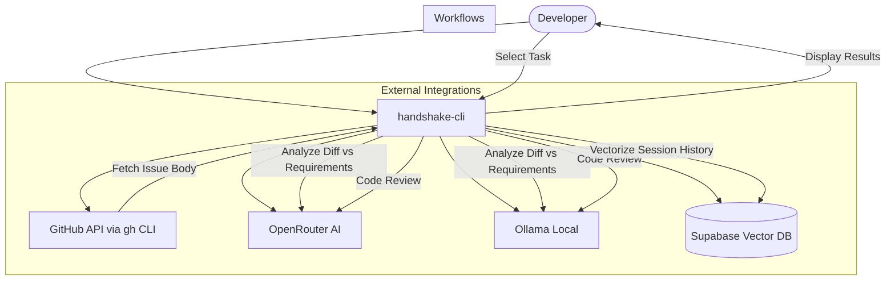

# Handshake CLI

<p align="center">
  
</p>

<p align="center">
  <strong>AI-powered code review workflows in your terminal.</strong>
</p>

---

Handshake is a terminal-based companion for developers that leverages AI to bridge the gap between requirements and implementation. It provides seamless integration with GitHub issues, automated code reviews, and a persistent AI memory system.

## 🚀 Key Features

### 📋 Requirements Coverage
Handshake analyzes your `git diff` against the description of a GitHub issue to ensure every requirement has been addressed. It can automatically detect the issue number from your current git branch name (e.g., `feature/issue-123` or `123-fix-bug`).

### 🔍 AI Code Review
Get immediate feedback on your staged changes. Handshake uses advanced LLMs to identify potential bugs, security vulnerabilities, and code quality improvements before you even push your code.

### 🧠 Persistent AI Memory
Synchronize your local AI session history with a Supabase vector database. This creates a long-term "project memory" that can be used for Retrieval-Augmented Generation (RAG), allowing the AI to understand the evolution of your project over time.

### 💻 Modern TUI
Built with [Bubble Tea](https://github.com/charmbracelet/bubbletea), the Handshake dashboard provides a fluid, interactive experience for managing your AI workflows.

---

## 📊 Use Case Diagram



---

## 📖 CLI Reference

Handshake can be used as an interactive dashboard or via direct commands for automation.

### `handshake` (Interactive Dashboard)
Running the binary without arguments opens the TUI dashboard.
```bash
./handshake
```

### `handshake coverage`
Analyzes code changes against a GitHub issue.
```bash
./handshake coverage [flags]
```
**Flags:**
- `--issue string`: The GitHub issue number (e.g., `123`). If omitted, Handshake attempts to extract it from the current branch name.
- `-p, --provider string`: The AI provider to use. Options: `openrouter` (default), `ollama`.

### `handshake review`
Performs an AI code review on staged changes.
```bash
./handshake review [flags]
```
**Flags:**
- `-p, --provider string`: The AI provider to use. Options: `openrouter` (default), `ollama`.

---

## 🛠️ Installation & Setup

### Prerequisites
- [Go](https://go.dev/) 1.21+
- [GitHub CLI (`gh`)](https://cli.github.com/) (authenticated)
- [Git](https://git-scm.com/)

### Build
```bash
git clone https://github.com/your-username/handshake-cli.git
cd handshake-cli
go build -o handshake
```

### Configuration
Set the following environment variables based on your workflow:

| Variable | Description | Provider |
| :--- | :--- | :--- |
| `OPENROUTER_API_KEY` | API Key for [OpenRouter](https://openrouter.ai/) | Cloud (Default) |
| `SUPABASE_URL` | Your Supabase project URL | Vector Sync |
| `SUPABASE_KEY` | Your Supabase service role key | Vector Sync |

---

## 🤖 AI Providers

### OpenRouter (Cloud)
By default, Handshake uses OpenRouter to access world-class models like `gemini-2.0-pro`. This requires an internet connection and an API key.

### Ollama (Local)
For privacy and offline use, Handshake supports [Ollama](https://ollama.com/).
1. Install Ollama.
2. Pull the required models:
   ```bash
   ollama pull qwen2.5-coder:1.5b
   ollama pull nomic-embed-text
   ```
3. Run Handshake with the `--provider ollama` flag.

---

## 📄 License
MIT License. See [LICENSE](LICENSE) for details.
